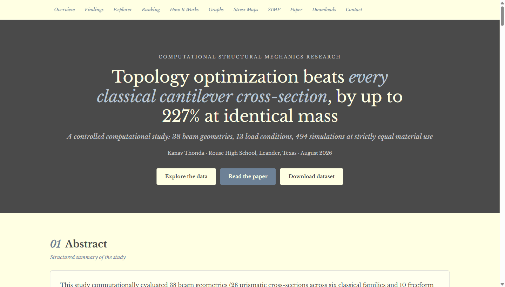
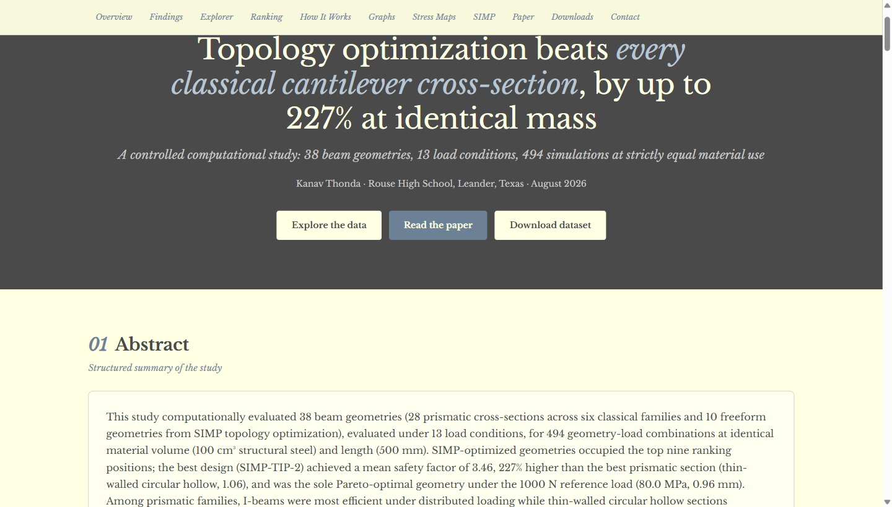
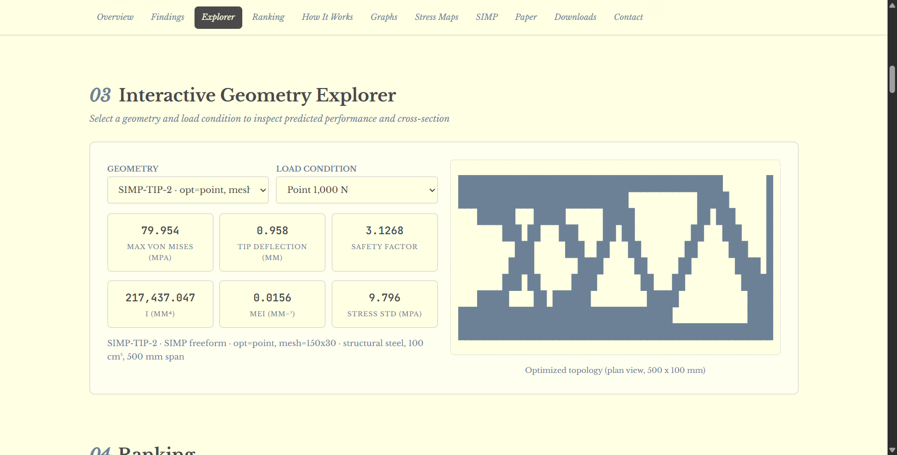
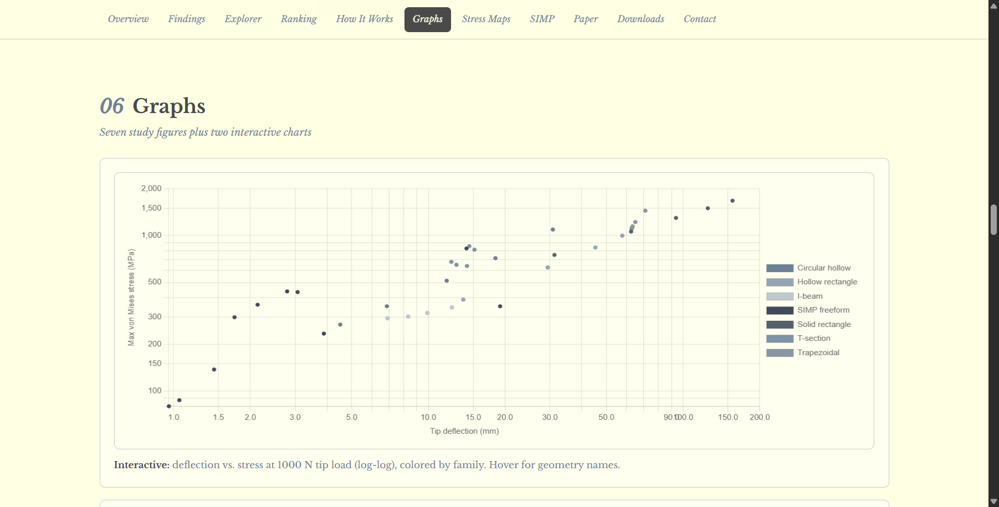

# The Cantilever Topology Reversal

**Topology optimization beats every hand-designed beam cross-section, by up to 227% at identical mass.**
A calibration-free, 494-configuration computational study of cantilever beam geometry under variable
load distributions, comparing 28 analytic cross-sections against 10 SIMP-optimized freeform topologies
at strictly equal material use.

**Live overview:** https://cantilever-beam-topology-optim.vercel.app

**Source:** https://github.com/kanav7810-oss/cantilever-topology

## Screenshots

| Hero | Findings |
|---|---|
|  |  |

| Explorer | Figures |
|---|---|
|  |  |

## The study

Classical cross-section textbooks prefer I-beams; topology-optimization papers prefer freeform trusses.
The two are almost never compared head-to-head under controlled conditions. This study does exactly
that: every geometry uses the same 100 cm&#179; of structural steel over the same 500 mm span, so the
only variable is geometry.

| Quantity | Value |
|---|---|
| Configurations | 494 (38 geometries x 13 load cases) |
| Prismatic sections | 28, in 6 families (solid rectangle, I-beam, hollow rectangle, T-section, trapezoidal, circular hollow) |
| Freeform designs | 10, from SIMP topology optimization (p = 3, volume fraction 0.4) |
| Load cases | point, UDL, triangular, combined, at 4 magnitudes |
| Beam theory | Euler-Bernoulli bending + thin-walled shear, strip integration validated to &lt;0.05% |
| Freeform analysis | 2D plane-stress finite element analysis |
| Verification | selftest.py, 50 assertions, all passing |
| Dataset | dataset.csv, 494 rows x 16 columns, zero missing values |

## Headline findings

1. **Freeform designs sweep the top nine rankings.** SIMP-TIP-2 achieves a mean safety factor of 3.46,
   up to 227% above the best prismatic section (thin-walled circular hollow CH-30, mean SF 1.06).
2. **SIMP-TIP-2 is the sole Pareto-optimal geometry** at the 1000 N reference load: 80.0 MPa peak stress
   and 0.96 mm tip deflection, dominating all 37 other geometries on both axes at once.
3. **The prismatic winner depends on load shape, not magnitude.** The circular hollow wins point loading
   (SF 9.33 at 100 N); the narrow-flange I-beam wins every distributed category. Safety factor scales
   exactly as 1/load, so rankings are magnitude-invariant.
4. **Second moment of area is the dominant prismatic variable.** I spans 1,333 to 217,437 mm&#8308;
   across all geometries, and the failure of flat, wide sections makes the case for structural depth.
5. **The SIMP advantage is smallest for point loads (3.35x) and largest for triangular loads (5.04x).**
   Distributed loads reward free load-path redesign the most.

Full details: [research_paper_humanized.md](research_paper_humanized.md) and
[research_paper.md](research_paper.md), plus a 494-row
[dataset.csv](dataset.csv).

## Repository map

```
index.html              interactive research overview (live at the link above)
style.css               site styles
script.js               explorer + dataset (embedded DATA, 494 rows) + interactive charts
favicon.svg             custom cantilever mark
research_paper.md       full manuscript
research_paper_humanized.md  web edition, humanized prose
dataset.csv             494 rows x 16 columns, the primary artefact
graph1..7 (.svg/.png)   publication figures
handoff.md              continuation brief: findings, next steps, open questions
selftest.py             50-assertion self-check suite
execution_trace/        planning trace from the original computational run
assets/screenshots/     site screenshots used in this README
```

## Viewing the site

Open `index.html` in any browser, or visit the live deployment at
https://cantilever-beam-topology-optim.vercel.app. The page is self-contained apart from web fonts
and the Chart.js CDN, and falls back to Georgia offline. The interactive explorer draws every
geometry cross-section from `script.js`, which embeds the full 494-row dataset.

## Provenance

The computational phase (geometry engine, SIMP optimizer, analyses, figures, manuscript) was executed
by the Biomni research agent (Phylo AI) and is documented in `handoff.md` and `execution_trace/`.
Every number on the site and in this README traces to `dataset.csv`; nothing is hand-typed, and all
features are reproducible from the embedded data layer.

## Status

This is a computational characterization in linear elastic, small-deflection theory at a single
envelope and material. The decisive validation experiment, physical fabrication and four-point bending
of the top geometries, has not been run; the full protocol is specified in `handoff.md`. The complete
scope discussion is available from the author on request.

## License and terms

Code, dataset and analysis outputs are released under the MIT License (see
[LICENSE](LICENSE)). Text and figures may be quoted for non-commercial educational purposes with
attribution to the author and a link to this repository.

The research results are computational model estimates. They are provided for educational purposes,
without warranty of any kind, and are not engineering advice; do not apply any value here to real
devices or processes without review by qualified professionals.

## Author

Kanav Thonda, Rouse High School, Leander TX. Correspondence welcome: manuscript, simulation code and
the validation protocol are available on request. Email kanav7810@gmail.com.